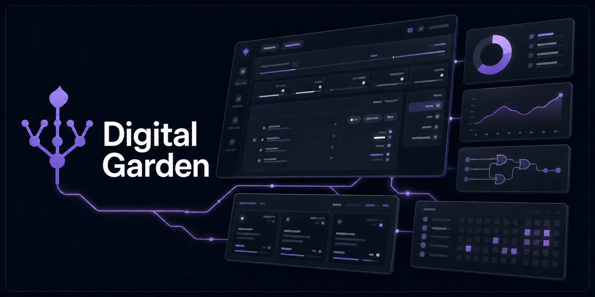

<div align="center">

# 🌱 الحديقة الرقمية · Digital Garden

**منصةٌ دراسيةٌ مجّانيّةٌ لطلاب الحوسبة والمعلوماتية في جامعة الأمير مساعد بن عبدالرحمن**
(الجامعة السعودية الإلكترونية سابقاً) — علومُ الحاسب، وتقنيةُ المعلومات، وعلومُ البيانات.
محتوى المقرَّر، مباشرةً، بلا حشو — وأدواتُ الفصل كلُّها في مكانٍ واحد.

[**افتح المنصة ←**](https://libbard.github.io/Garden/)
· [جولةٌ تفاعلية](https://libbard.github.io/Garden/tour.html)
· [تليجرام](https://t.me/Computing_and_Informatics)
· [البلاغات والاقتراحات](https://groups.google.com/g/digital_garden)

`عربي / English` · `داكن · خافت · فاتح` · `١٦ جلداً` · `يعمل بلا إنترنت` · `بلا تسجيل ولا بريد`

`مجّانيّةٌ للاستخدام والتطوير بذكر المصدر · ممنوعةٌ تجارياً` — [الرخصة](#الرخصة)

</div>

---

## الأرقام

| | |
|---:|:---|
| **٨٢** | مقرَّراً — ‏٢٤ في علوم الحاسب و‏٢٤ في تقنية المعلومات و‏٢٢ في علوم البيانات، ومعها ‏١٢ عامّةً وداعمة |
| **١٬٠٢٩** | وحدةً دراسيةً مشروحة |
| **٦٬٨٧٤** | مفهوماً بثلاثة أعماق: سريعٌ وكاملٌ وعميق |
| **١٧٬٠١٧** | بطاقةَ مراجعةٍ بالتكرار المتباعد |
| **٨٩٬٠٦١** | سؤالاً — ‏٥٣٬٤٥٠ اختيارٍ من متعدّد و‏٢٥٬٣١٩ مقاليّاً و‏١٠٬٢٩٢ داخل الوحدات |
| **٤٬٧٣٦** | مصطلحاً ذكياً يُعرَّف بلمسة، في ‏٧٬٦٣٢ موضعاً |
| **٢٬٨٧١** | مخطَّطاً تفاعلياً (SVG) |
| **٦٬١٩٤** | فيديو مُنتقىً عبر ٦٨٧ وحدة |
| **١٬٥٤٢** | صفحةً مفهرسةً في خريطة الموقع |
| **٨٤٬٠٣٢** | شعبةً من ٣٨ فصلاً دراسياً |
| **٢٣٠** | عضوَ هيئةِ تدريسٍ بـ‏٧٨٣ تقييماً |
| **٦٢٤** | مقرَّراً في ٢٠ خطّةً جامعيةً رسمية |

---

## المحتوى الدراسي

- **ثلاثةُ تخصّصات**: علومُ الحاسب وتقنيةُ المعلومات وعلومُ البيانات، تختار تخصّصك في كلِّ مستوى فتظهر موادُّه.
- **شرحُ كلِّ وحدة** ثنائيَّ اللغة، مبنيٌّ من الكتاب المقرَّر لا من خارجه، وكلُّ مفهومٍ بثلاثة أعماق: سريعٌ وكاملٌ وعميق.
- **بطاقاتٌ بالتكرار المتباعد** على خوارزمية **SM‑2** — تعرض ما أوشكتَ على نسيانه اليوم فقط.
- **اختباراتٌ لكلِّ وحدةٍ ولكلِّ منتصفٍ ونهاية**: اختيارٌ من متعدّد بتصحيحٍ فوريّ، ومقاليٌّ بإجابةٍ نموذجية.
- **مراجعاتٌ مركَّزة** قبل الميد والفاينل.
- **مصطلحاتٌ ذكية**: أيُّ مصطلحٍ تقنيٍّ يُعرَّف باللمس، بالعربية والإنجليزية.
- **مخطَّطاتٌ متجهيّة** تشرح ما لا يشرحه النصّ.
- **فيديوهاتٌ مختارة** لكلِّ موضوعٍ داخل الوحدة — مفرزةٌ بمعيارٍ لا بالمشاهدات.

## الملاحظات

دفترُ دراستك داخل المنصّة — يعمل بلا إنترنت ويتزامن بين أجهزتك.

- **محرِّرُ كتلٍ** ثنائيُّ الاتّجاه: نصٌّ وعناوينُ وقوائمُ وجداولُ وكودٌ، ولصقٌ يتعرّف على المحتوى.
- **معادلاتٌ رياضية** بصيغة LaTeX، و**مخطَّطاتُ Mermaid** تُرسم من نصِّها.
- **بحثٌ واستبدالٌ** داخل الملاحظة، و**سجلُّ تعديلاتٍ** ترجع إليه.
- **رسمٌ بالقلم** على الورقة نفسِها: يعمل بالقلم واللمس والفأرة، ولا يتحرّك الرسمُ إذا تغيّر عرضُ الصفحة.
- **ملفّاتُ PDF**: افتحْ ملفَّك وظلِّل واكتبْ وارسمْ عليه وابحثْ في نصِّه — وتُحفظ نسخةٌ منه عندنا فتجده على جهازك الآخر.
- **طباعةٌ وتصدير** إلى A4 و PDF بصفحاتٍ ثابتة لا تُقصّ ولا تُضغط.
- **محوِّلٌ** لما تنسخه من ChatGPT وGemini وClaude: يصير كتلاً منظَّمةً في ملاحظتك.
- **مرسمُ الحديقة**: صفحاتُ تلوينٍ ورسوماتٌ جاهزة بأدواتِ رسّامٍ حقيقيّة — رصاصٌ وخشبيٌّ ومائيٌّ يسيل ويجفّ، وباستيلٌ وزيتٌ وبخّاخ. لوّنْ بيدك أو دعْها تتلوّن وحدها، ثمّ احفظْها في «رسوماتي» أو أدرجْها في ملاحظتك.

## أدواتُ الفصل

| الأداة | ماذا تفعل |
|---|---|
| **لوحتي** | حالتُك الأكاديميةُ كلُّها في شاشة — ودجات تُرتَّب بالسحب، وعرضٌ مضغوطٌ لمن يريد |
| **فصلي** | مقرَّراتُ فصلك الحاليّ، تقدُّمُك في كلٍّ منها، ومتى ينتهي |
| **صفحةُ المادة** | الوحدات · الاختبارات · الدرجات · توقُّعُ نتيجتك من محاولاتك |
| **الملاحظات** | محرِّرٌ وقلمٌ وPDF — انظر القسمَ أعلاه |
| **الجدول** | محاضراتُك وامتحاناتُك — أسبوعياً وشهرياً، وقابلٌ للطباعة A4 |
| **الشُّعب** | بحثٌ في ٨٤ ألف شعبةٍ من بانر: الوقتُ والقاعةُ والمقاعدُ والأستاذ والشروط |
| **المعدل** | حسابُ المعدل على مقياس PMAU 4.0، ومستشرِفٌ يرسم ما تحتاجه لتبلغ هدفك |
| **الأساتذة** | تقييماتُ الطلاب لأعضاء هيئة التدريس — وتقييماتُ المقرَّرات نفسِها |
| **المختبرات** | تطبيقاتُ ويبٍ كاملةٌ تُشغَّل في المتصفّح |
| **البحث** | مفاهيمُ الوحدات والفيديوهات وأمثلةُ الكود والموادُّ والأساتذةُ والشعب في مكانٍ واحد (`Ctrl K`)، ومعها ملاحظاتُك ومهامّك تُبحث في جهازك وحده |
| **المظهر** | ستّةَ عشرَ جلداً يعيد كلٌّ منها رسمَ الموقع، وخلفيّاتٌ تختارها — انظر القسمَ أدناه |
| **الإعدادات** | الثيم · اللغة · حجمُ الخطّ ومكتبةُ خطوطِ قراءة · المزامنة · التنبيهات · تصديرُ بياناتك كاملةً |
| **الجولة** | تعريفٌ تفاعليٌّ بكلِّ ما سبق، لأوّل مرّةٍ تفتح فيها المنصّة |

## المظهر

الجلدُ ليس لوناً يتبدّل؛ كلُّ جلدٍ يعيد رسمَ الموقع كلِّه بخطوطه وصوره، في الوضعين الداكن والفاتح:

| | |
|---|---|
| **عقدُ الصيّاد** · **المخطّط** · **بنتو** · **المحرّر** | دفترُ مهامّ في لعبة · دفترٌ مفتوحٌ على صفحتين · مربّعاتٌ بأحجامٍ ومرسًى عائم · محرّرُ كودٍ لطلاب الحاسب |
| **مانغا** · **سكّر** · **أندلس** · **هادئ** | لوحاتُ قصّةٍ مصوّرة · قطعٌ طريّةٌ وزهرةٌ تنمو · أقواسٌ ونقشٌ ثمانيّ · جملةٌ واحدةٌ ولا إطارات |
| **شريحةُ الدم** · **الذئبُ الأبيض** · **همّةُ طويق** · **مطرُ النيون** | مختبرُ أدلّةٍ في ليل ميامي · عقودٌ مسمّرةٌ وأوراقُ لعب · شرفاتٌ نجديّةٌ وسدو · زجاجُ مقهًى ومطرٌ حقيقيّ |
| **الأعماقُ المضيئة** · **صالةُ المغادرة** · **غرفةُ المذاكرة** · **قيدُ التشغيل** | غطسةٌ بمصباح غوّاص · لوحةُ رحلاتٍ تتقلّب حروفُها · مكتبٌ ليليٌّ ومصباح · الفصلُ ألبومٌ يدور |

وخلف كلِّ صفحةٍ خلفيّةٌ تختارها: تدرّجٌ حيّ، أو أمواج، أو بكسلات، أو نقشٌ من اثني عشر، أو لونُك، أو صورةٌ من جهازك أو من مكتبة صورٍ مجّانيّة.

## المختبرات

- **مختبرُ الدوائر المنطقية** (CS231) — بناءُ الدوائر وتبسيطُها ومحاكاتُها.
- **مختبرُ لغات البرمجة** (CS363) — **٣١ لغة** و**١٬٨٧٠ مثالاً**، تُشغَّل في المتصفّح أو على الخادم بخيار الطالب.

## المزامنة والبيانات

- **بلا حسابٍ ولا بريدٍ ولا كلمةِ مرور.** مفتاحٌ واحدٌ يربط أجهزتك.
- **ربطُ جهازٍ برمز QR** أو برمزٍ من اثنَي عشر حرفاً يُنسخ — والرمزُ يموت بعد ثلاث دقائق.
- **طريقُ عودة** إن ضاع مفتاحُك: ملفٌّ تُنزِّله، أو بريدٌ وكلمةُ سرٍّ **لا يحفظ الخادمُ بريدَك ولا يرى كلمتَك**، أو حسابُ قوقل.
- **سِجلُّ أجهزتك** — تراها وتفصل أيَّها شئت.
- **مختومةٌ بمفتاح جهازك**: ما يُزامَن يُشفَّر بمفتاحٍ يُشتقّ من سرِّك ولا يُحفظ عندنا، فلا تُفتح خزنتُك بمعرّفها وحدَه.
- **الدمجُ بنيويّ**: تعديلان على جهازين مختلفين يجتمعان، ولا يدهس أحدُهما الآخر.
- **جهازُك أوّلاً**: كلُّ شيءٍ يعمل بلا إنترنت، والسحابةُ نسخةٌ لا مصدر.

## الخصوصيّة

بلا مزامنةٍ يبقى ما تكتبه في جهازك وحده، ويعمل الموقعُ كلُّه دون خادمنا، إلا ما تطلبه أنت بنفسك، كسؤالٍ للمساعد أو ترجمةِ نصٍّ أو بحثٍ أو كودٍ تشغّله على الخادم أو تنبيهٍ يصلك والموقعُ مغلق.

ونقيس استعمالَ الموقع آليّاً بلا اسمٍ ولا حساب: أيُّ الصفحات تُفتح وكم يُمكث فيها، وأيُّ المزايا تُستعمل وأين يتعثّر الطالب. ويُحلَّل ذلك آليّاً للبحث عن الثغرات وفرص التطوير والمزايا التي لا تُستعمل. ويقيس Google Analytics نحوَ ذلك أيضاً.

وإن فعّلتَ المزامنة حُفظت نسخةٌ من بياناتك لدينا مشفّرةً، لتصل إلى أجهزتك.

## التنبيهات

- **تنبيهاتٌ للمهامّ والاختبارات** — تصلك والتبويبُ مغلق.
- **تنبيهاتُ الشُّعب**: يُفتح مقعدٌ في شعبةٍ تراقبها ⇒ يصلك خبرُها.
- **تقويمُ البلاك بورد**: ألصِق رابطَ ICS فتدخل مواعيدُك جدولَك.

## تحتَ الغطاء

- **الواجهة** — HTML5 وJavaScript خالص وCSS3. لا إطار، ولا حزمة، ولا خطوةَ بناء.
- **PWA** كاملةٌ بعامل خدمة: تُثبَّت كتطبيق، وتعمل بلا شبكة، والكاشُ تفاضليٌّ لا مسحٌ شامل.
- **ثلاثةُ أوضاعٍ وستّةَ عشرَ جلداً** وخمسةُ أحجامِ خطّ، وتبديلُ لغةٍ بلا إعادةِ تحميل. خطوطُ الجلود وصورُها مستضافةٌ محلّيّاً، ولا يُحمَّل جلدٌ لم تختره.
- **بحثٌ على الخادم** في محتوى المنصّة كلِّه، بينما تُبحث ملاحظاتُك في متصفّحك وحده.
- **الأنبوب** — بايثون: من الكتاب المقرَّر (PDF) إلى صفحةٍ تفاعلية، بالمخطَّطات والبطاقات والأسئلة.
- **السحابة** — Cloudflare Workers على الحافّة، وPostgres على خادمٍ في جدة.
- **الأصلُ مقفول**: لا تخدم الخدماتُ متصفّحاً إلا من `libbard.github.io`.

---

## البنية

```
root/
├── index.html          لوحتي
├── tour.html           الجولة التفاعلية
├── L3 … L8/            المقرَّرات بمستوياتها  →  <CODE>/M##.html
├── others/             العامّة والداعمة
├── hub/                فصلي · المادة · الملاحظات · الجدول · الشُّعب · المعدل · الأساتذة · المختبرات · البحث · الإعدادات
├── labs/               المختبرات المنشورة
├── shared/             ١٦٤ ملفَّ JS و٧٨ ورقةَ CSS — الشِلُّ الموحَّد، والجلودُ في shared/skins/
└── sw.js               عامل الخدمة
```

## الرخصة

**مجّانيّةٌ للنسخ والاستخدام والتطوير — بذكر المصدر — وممنوعةٌ تجارياً.**
لا بيعَ لها ولا استعمالَ لها في نشاطٍ يدرّ مالاً، ولا نشرَ لها أو لنسخةٍ معدَّلةٍ منها بلا ذكر مؤلِّفها.

| المادّة | الرخصة |
|---|---|
| البرمجيّات | [PolyForm Noncommercial 1.0.0](LICENSE-CODE.md) |
| المحتوى التعليميّ (شروحٌ وبطاقاتٌ وأسئلةٌ ومخطَّطات) | [CC BY-NC 4.0](LICENSE-CONTENT.txt) |

اذكرْ في نسختك المنشورة، حيث يراه الزائر:

> Based on Digital Garden by Libbard - https://github.com/Libbard/Garden

الاستثناءاتُ (المكتباتُ الخارجيّة · خطُّ ثمانية · كتبُ الجامعة) وتفاصيلُ ما يجوز وما لا يجوز في [LICENSE](LICENSE).
والنسخُ التي أُخذت قبل ٣٠ سبتمبر ٢٠٢٦ كانت تحت رخصة MIT وتبقى كذلك عند من أخذها.

## للمساهمة

المحتوى الدراسيُّ **مولَّد** من `engine/` ولا يُحرَّر في `root/` مباشرةً.
والبلاغُ عن خطأٍ علميٍّ أو رابطٍ مكسور أنفعُ من تصحيحه في مكانٍ يُعاد بناؤه.
وما تقدّمه من تعديلٍ أو إضافةٍ يُفهم أنك تمنحه بالرخصة نفسِها.

---

## About (English)

**Digital Garden** is a free, bilingual (Arabic / English) study platform for Computer Science,
Information Technology and Data Science students at PMAU (جامعة الأمير مساعد بن عبدالرحمن, formerly
the Saudi Electronic University): 82 courses and 1,029 units with explanations at three depths,
spaced-repetition flashcards, quizzes, a notes app with PDF annotation, pen input and a colouring
studio, site-wide search, a schedule, GPA calculator, section finder, sixteen skins that redraw the
whole site, offline PWA and cross-device sync without accounts. Free for non-commercial use with
attribution; no commercial use or resale.

**Privacy.** Without sync, what you write stays on your device alone, and the whole site works without our server — except what you ask for yourself, such as a question to the assistant, translating text, a search, code you run on the server, or a reminder that reaches you while the site is closed. We measure how the site is used automatically, without your name or account: which pages are opened and how long they stay open, which features are used, and where students get stuck. This is analysed automatically to find gaps, chances to improve, and features that go unused. Google Analytics measures much the same. If you turn on sync, a copy of your data is kept with us, encrypted, so it can reach your devices. Synced data is encrypted with a key derived from your device's secret, which we never store.

<div align="center">

**الحديقة الرقمية © 2026** · PMAU CS
[libbard.github.io/Garden](https://libbard.github.io/Garden/)

</div>
